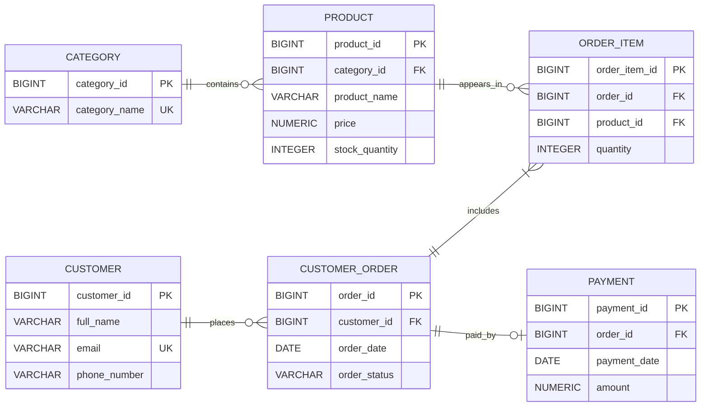

```mermaid
erDiagram
    direction LR

    CUSTOMER {
        BIGINT customer_id PK
        VARCHAR full_name
        VARCHAR email UK
        VARCHAR phone_number
    }

    CATEGORY {
        BIGINT category_id PK
        VARCHAR category_name UK
    }

    PRODUCT {
        BIGINT product_id PK
        BIGINT category_id FK
        VARCHAR product_name
        NUMERIC price
        INTEGER stock_quantity
    }

    CUSTOMER_ORDER {
        BIGINT order_id PK
        BIGINT customer_id FK
        DATE order_date
        VARCHAR order_status
    }

    ORDER_ITEM {
        BIGINT order_item_id PK
        BIGINT order_id FK
        BIGINT product_id FK
        INTEGER quantity
    }

    PAYMENT {
        BIGINT payment_id PK
        BIGINT order_id FK
        DATE payment_date
        NUMERIC amount
    }

    CUSTOMER ||--o{ CUSTOMER_ORDER : places
    CATEGORY ||--o{ PRODUCT : contains
    CUSTOMER_ORDER ||--|{ ORDER_ITEM : includes
    PRODUCT ||--o{ ORDER_ITEM : appears_in
    CUSTOMER_ORDER ||--o| PAYMENT : paid_by
```
